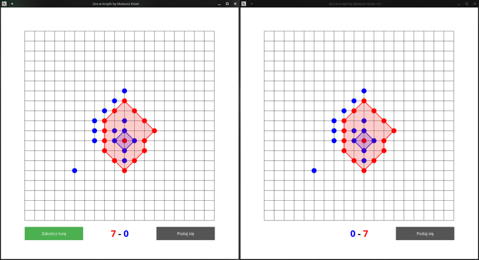
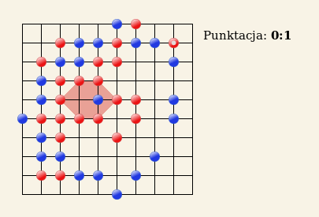

## SuperKropki _by Mateusz Kisiel_

### Opis projektu:
Jest to gra w kropki napisana w C z użyciem GTK 3. Każdy gracz uruchamia swoją instancję programu. Komunikacja następuje poprzez pliki (mogą być one w sieciowej lokalizacji, aby grać na różnych komputerach).

### Screen z gry:

### Zasady gry:
Istnieje wiele wersji gry w kropki:
* https://pl.wikipedia.org/wiki/Kropki_(gra) 
* https://zagram.org/info/kropki-rules.po.html.  

Postanowiłem, że zasady będą takie same jak na jedynej działającej stronie z tą grą: https://zagram.org/.
#### Ważne uwagi:
*Można samemu wybrać kształt bazy i ją zamknąć (pod warunkiem, że zamknięcie jej spowoduje zdobycie jakiegokolwiek punktu). Można to zrobić, gdy ma się ruch np. przed postawieniem kropki oraz także po postawieniu kropki (Aby nie oddać tury przeciwnikowi po postawieniu kropki należy aktywować toggle button zrobić ruch, stworzyć tyle baz ile chcemy, a następnie dezaktywować, co zakończy turę. W większości tur jednak nie chcemy tworzyć baz, więc dla wygody kończą się po postawieniu kropki).*

#### Punktacja: 
*Za każdą kropkę gracza A zamkniętą w bazie gracza B, gracz B otrzymuje punkt, chyba, że jego baza będzie zamknięta w jeszcze większej bazie gracza A.*

### Jak uruchomić:
#### Na Linuxie:
1. Zainstaluj kompilator oraz gtk3: \
   `sudo apt-get install gcc` \
   `sudo apt-get install libgtk-3-dev` with all dependencies \
   `sudo apt-get install cmake`
2. Zbuduj projekt: \
   `cmake -S . -B cmake-build-debug/` \
   `cmake --build cmake-build-debug/ --target Kropki`
3. Przekopiuj zasoby: \
   `cp {saveIcon.png, styles.css} ./cmake-build-debug/`
4. Uruchom grę w dwóch instancjach: \
   `cd cmake-build-debug` \
   `./Kropki A & ./Kropki B`

#### Na Windowsie:
1. Zainstaluj GCC, GTK i CMake poprzez MSys2 (https://www.gtk.org/docs/installations/windows/) \
   Możesz to zrobić poprzez: \
   `pacman -S mingw-w64-x86_64-gtk3` \
   `pacman -S base-devel mingw-w64-x86_64-toolchain` \
   `pacman -S mingw-w64-x86_64-cmake`
2. Dodaj `C:\msys64\mingw64\bin` do `PATH`
3. Przekopiuj zasoby: \
   `cp {saveIcon.png, styles.css} ./cmake-build-debug/`
4. Wybierz w Clion odpowiedni kompilator (MSys2 - MinGW)
5. Uruchom konfigurację w Clion o nazwie Both (odpala ona program w dwóch instancjach)

### Moduły:

* ***Serializer*** – zawiera przydatne funkcje do serializowania i deserializowania danych

* ***Communication*** – odpowiada za komunikację z drugą instancją programu. Zawiera funkcje wysyłące i odbierające pakiety

* ***GameLogic*** – odpowiada za logikę gry. Trzyma i przetwarza stan gry, sprawdza czy ruchy są legalne, wysyła event gdy zmieniła się liczba punktów lub zakończyła się gra.

* ***GameWidget*** – odpowiada za wygląd gry i interakcje z użytkownikiem. Trzyma w sobie obiekt typu GameLogic. Tworzy custom kontrolkę z użyciem biblioteki cairo.

* ***Vector, Queue*** – implementacje kolejki i dynamicznej tablicy

* ***MenuWindow*** – moduł obsługujący okno menu

* ***GameWindow*** – moduł obsługujący okno gry

* ***MathHelper, GtkHelper*** – zawiera pomocnicze funkcje i struktury

Większość modułów zawiera komentarze (w pliku nagłówkowym lub pliku .c) nazwy funkcji są dosyć intuicyjne, więc powinno być wiadomo o co chodzi.

